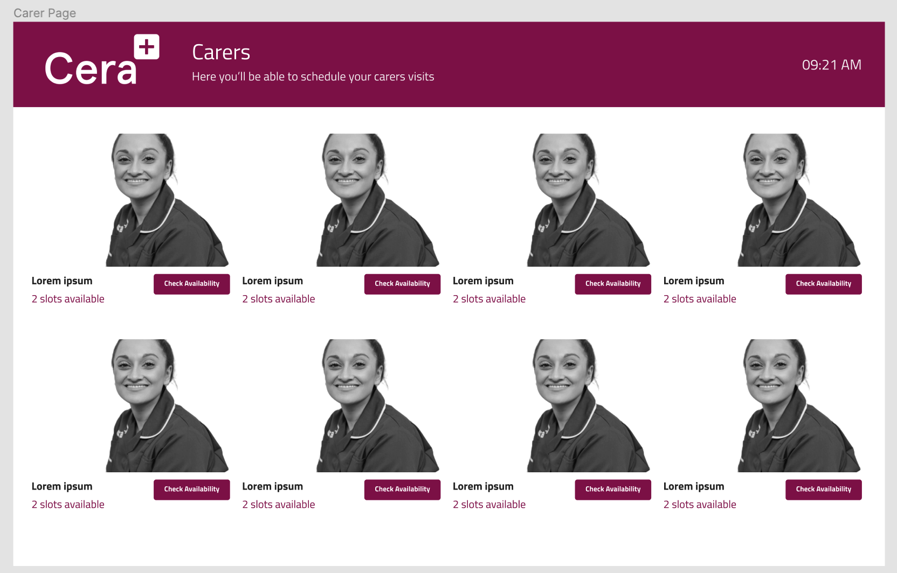
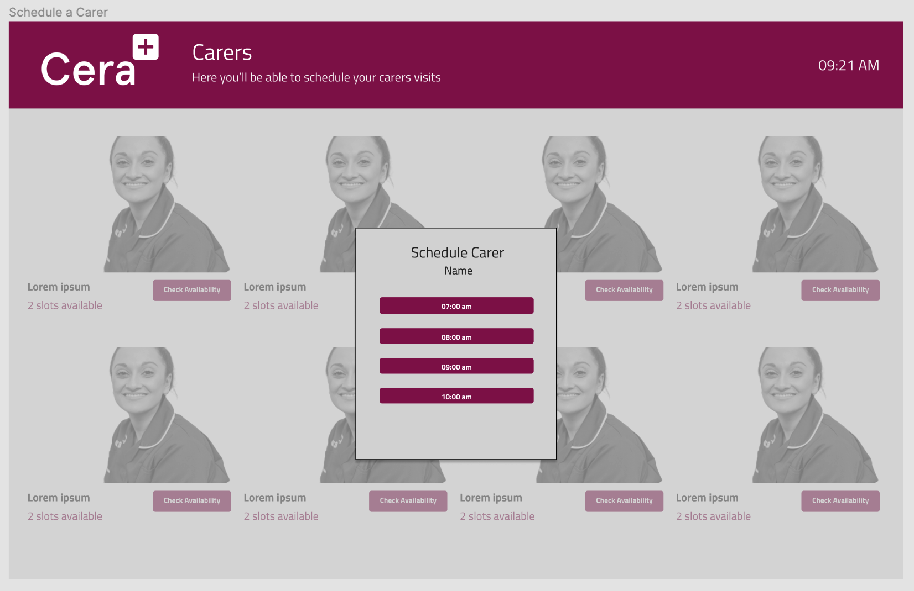

# Carer Management

Cera needs an internal system to handle their carers availabilty.
For this assignment, write a React web application that will handle the following user scenarios.

## User Scenarios

- As a user I want to see all carers available with their current available slots
- As a user I want to check the carer availabilty and be able to schedule a slot.
- As a user I want to see the current time and have it updating in real time

## Specifics

Build your application according to the following design: https://www.figma.com/file/3J87foE1c4LM1poiezyfDW/Cera-FE-Assignment?node-id=0%3A1

- Fetch the carers, using the following REST endpoint: https://ceracare.github.io/carers.json
- Check for available slots for your carer using the following REST endpoint: https://ceracare.github.io/availableSlots.json
- To schedule a carer on a specific time slot, call the following REST endpoint: https://ceracare.github.io/bookSlot.json

## Specifics
Build your application according to the following designs 

- Fetch the carers, using the following REST endpoint: https://ceracare.github.io/carers.json
- Check for available slots for your carer using the following REST endpoint: https://ceracare.github.io/availableSlots.json
- To schedule a carer on a specific time slot, call the following REST endpoint: https://ceracare.github.io/bookSlot.json

## How to submit
- Share your assignment by sending to us the link to your repository.
- Spend a maximum of 12 hours on this assignment. If you feel like there is something missing, just describe what you would've done in your README file. Write your code as if it were production code.

Note: Feel free to add any extra design choices or packages to help you in development. If so make sure it's documented

